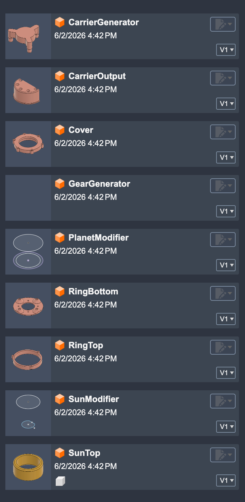
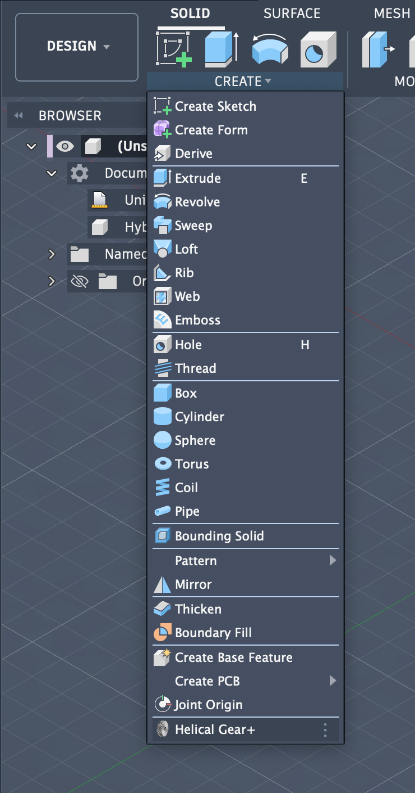
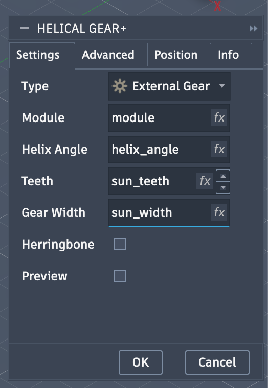
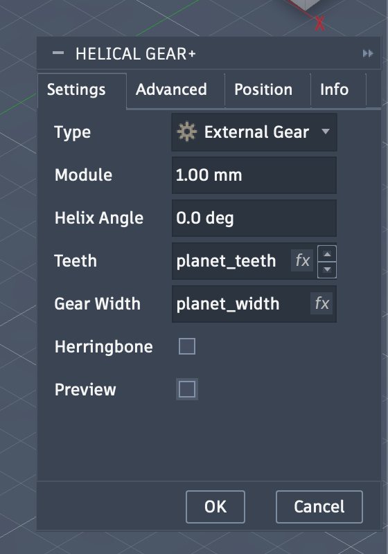
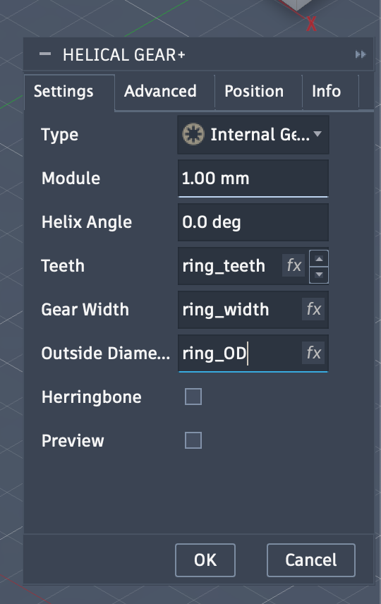
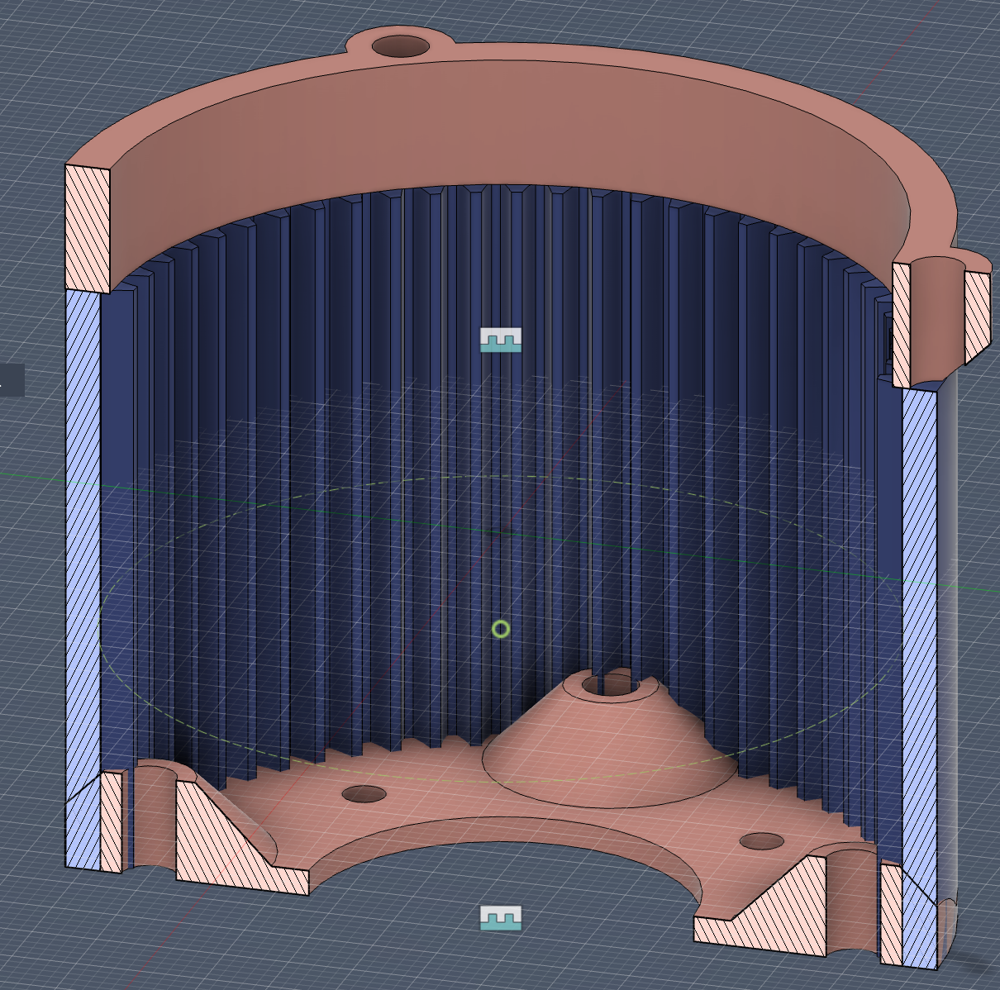
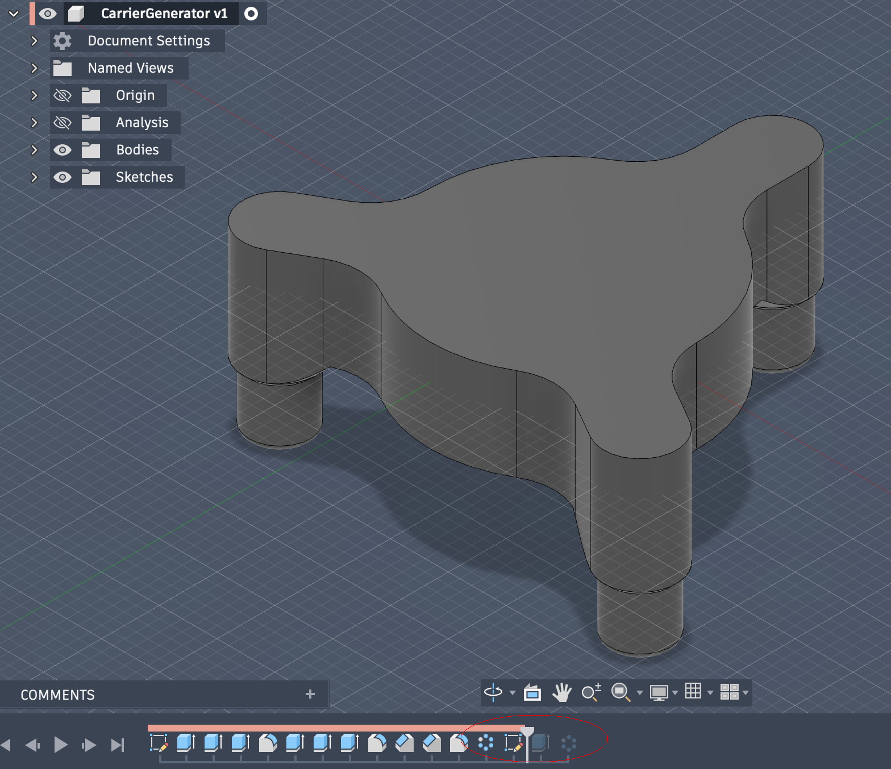

# Nema-17/23-planetary-gear

A fully parametric planetary gearbox designed for NEMA 17/23 motors.
Gear ratio, backlash, and geometry can be adjusted through parameters.

### Software Requirements 
[Fusion 360 (free to download)](https://www.autodesk.com/campaigns/fusion-360/download)

[Fusion 360 Helical Gear Plus plugin](https://apps.autodesk.com/FUSION/en/Detail/Index?id=1259509007239787473&appLang=en&os=Mac)

### Parts List
* M3 heat inserts 
    * (L5 $\times$ 4.2mm OD) $\times$ 15
* M3 hex bolts
    * 91290A120 (16mm)  $\times$ 3
    * 91290A115 (10mm)  $\times$ 3
    * 91290A111 (6mm)  $\times$ 4
* Deep groove ball bearings
    * 4668K269 (35mm $\times$ 47mm $\times$ 7mm) $\times$ 1
    * 2349K726 (12mm $\times$ 21mm $\times$ 5mm) $\times$ 2
    * 4668K225 (5mm $\times$ 11mm $\times$ 5mm) $\times$ 6

### Design Notes

* Spur gears are used for simplicity and efficiency
* Sun gear is reused across configurations
* Three planets provide a balance between load sharing and complexity
* Geometry is driven by parameters (module, teeth count, bearing sizes)

### Important Limitation
Parameters are not global across files.

If you change a parameter (e.g. gear ratio), you must update it in all generator files.

This violates DRY principle, instead, global params should be used.

[Global Parameters in Fusion 360 | Explained in 5 minutes](https://www.youtube.com/watch?v=VsqRV7JvBKc)

### Workflow Overview
The gearbox is built in three stages:

* Generate base gears (sun, planet, ring)
* Modify components (add bearings, mounts, clearances)
* Assemble stages (carrier + gears)

### Generate Gears

Create a new project and import the .f3d files

Open `GearGenerator`

Have a look at the params

Start creating the sun gear, open `Helical Gear+`

Fill the fields with the sun gear params

(_Advanced config will be the same for planet and ring_)

In the same manner create the planet gear

And the ring gear, don't forget to change Type to `Internal Gear`

You should end up with this

Export ring gear as `RingTemp` to your project

In the same manner, export planet gear as `PlanetTemp` and sun gear as `SunTemp`

Close current design without saving

### Modify Components

Open `SunModifier`

Check its params as well

Insert the `SunTemp` component

Break the link

Extrude and fillet the bearing mount, make sure operation for extrude is `Join`

Export component as `Sun` to your project

Cut and fillet motor shaft

Chamfer from the inside

Should end up with this

Export component to project as `MotorInput`

Close current design without saving

_If you create another gearbox with a different gear ratio, `Sun` and `MotorInput` will stay the same, no need to regnerate them_

---
In the same manner, open `PlanetModifier` and insert `PlanetTemp`

Break link

Cut hole for bearing

Fillet

Cut hole for bearing lip

Should end up with this

Export to project as `Planet`, close current design without saving, move `PlanetTemp` to trash

We now have all the components, time to combine them

### Assemble Components

In a new Hybrid Design, import `RingBottom`, `RingTemp` and `RingTop`

Break link any of them

Join `RingBottom` and `RingTemp` at their bottoms

Join `RingTemp`'s top and `RingTop`'s bottom

Should end up with this

Combine all of them as new component, export it to project as `Ring`, close current design without saving, move `RingTemp` to trash

---

Open `CarrierGenerator`, note the timeline is pulled 2 steps

insert `Sun`

Break link any of them

Join `Sun`'s bottom with `Carrier`'s top at their centers

.png)

Should end up with this

Combine all of the as new component, export it to project as `FirstStage`

Close current design without saving

Move `Sun` to trash

---

Open `CarrierGenerator`, move the timeline marker all the way to the end

Insert `CarrierOutput`

Break link any of them, join `CarrierOutput` bottom at `CarrierGenerator`'s top at their centers

Should end up with this

Combine all as new component, export it to project as `SecondStage`

### Export for Printing

* Cover
* FirstStage
* SecondStage
* Ring
* Planet
* MotorInput
* SunTop

❗ Make sure you print `SecondStage` at 45&deg; with 100% infill as it handles the most torque

[The Correct Orientation to Print Boxes](https://www.youtube.com/watch?v=8NKVNwVaZU0)

[Autodesk Fusion: Make supports like Slant 3D](https://www.youtube.com/watch?v=sn2u949g7dM)

Print 6 `Planet`s ($n_{stages} \times n_{planetsPerStage}$)

Print 2 `SunTop`s (_1 per stage_)

Print takes ~5 hours and ~100 gm of filament