# Nema-17/23-planetary-gear

A fully parametric planetary gearbox designed for NEMA 17/23 motors.

Gear ratio, backlash, and geometry can be adjusted through parameters.

### Software Requirements 
[Fusion 360 (free to download)](https://www.autodesk.com/campaigns/fusion-360/download)

[Fusion 360 Helical Gear Plus plugin](https://apps.autodesk.com/FUSION/en/Detail/Index?id=1259509007239787473&appLang=en&os=Mac)

### Parts List
* M3 heat inserts 
    * (L5 $\times$ 4.2mm OD) $\times$ 15
* M3 hex bolts
    * 91290A120 (16mm)  $\times$ 3
    * 91290A115 (10mm)  $\times$ 3
    * 91290A111 (6mm)  $\times$ 4
* Deep groove ball bearings
    * 4668K269 (35mm $\times$ 47mm $\times$ 7mm) $\times$ 1
    * 2349K726 (12mm $\times$ 21mm $\times$ 5mm) $\times$ 2
    * 4668K225 (5mm $\times$ 11mm $\times$ 5mm) $\times$ 6

### Design Notes

* Spur gears are used for simplicity and efficiency
* Sun gear is reused across configurations
* Three planets provide a balance between load sharing and complexity
* Geometry is driven by parameters (module, teeth count, bearing sizes)

### Important Limitation
Parameters are not global across files.

If you change a parameter (e.g. `gear_ratio`, `helix_angle` etc..), you must update it in all other files.

This violates DRY principle, instead, global params should be used.

[Global Parameters in Fusion 360 | Explained in 5 minutes](https://www.youtube.com/watch?v=VsqRV7JvBKc)

### Workflow Overview
The gearbox is built in three stages:

* Generate base gears (sun, planet, ring)
* Modify components (add bearings, mounts, clearances)
* Assemble stages (carrier + gears)

### Generate Gears

Create a new project and import the .f3d files

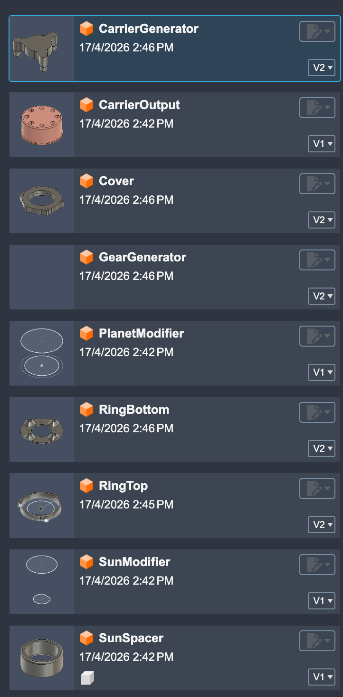

Open `GearGenerator`

Have a look at the params

Start creating the sun gear, open `Helical Gear+`

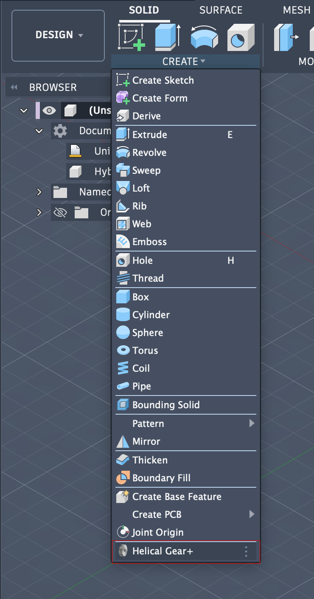

Fill the fields with the sun gear params

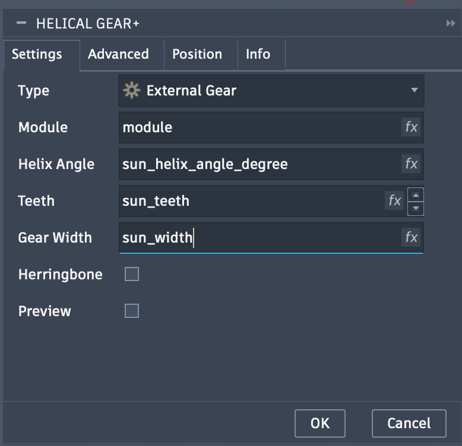

(_Advanced config will be the same for planet and ring_)

In the same manner create the planet gear

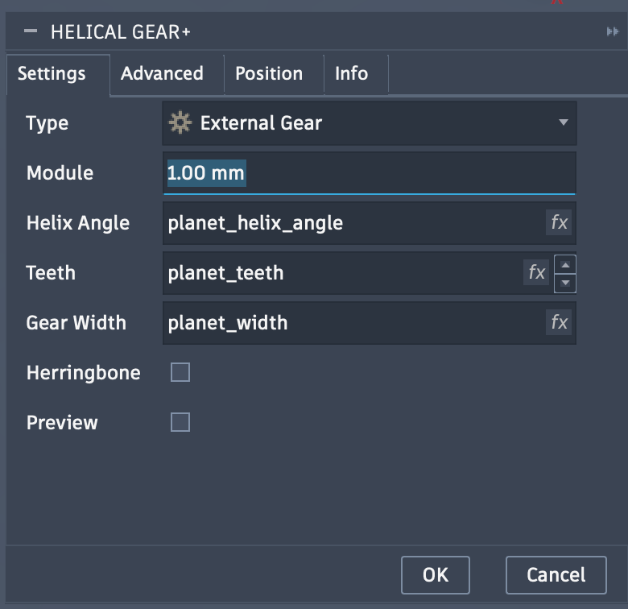

And the ring gear, don't forget to change Type to `Internal Gear`

You should end up with this

Export ring gear as `Ring` to your project

In the same manner, export planet gear as `PlanetTemp` and sun gear as `SunTemp`

Close current design without saving

### Modify Components

Open `SunModifier`

Check its params as well

Insert the `SunTemp` component

Break the link

Extrude and fillet the bearing mount, make sure operation for extrude is `Join`

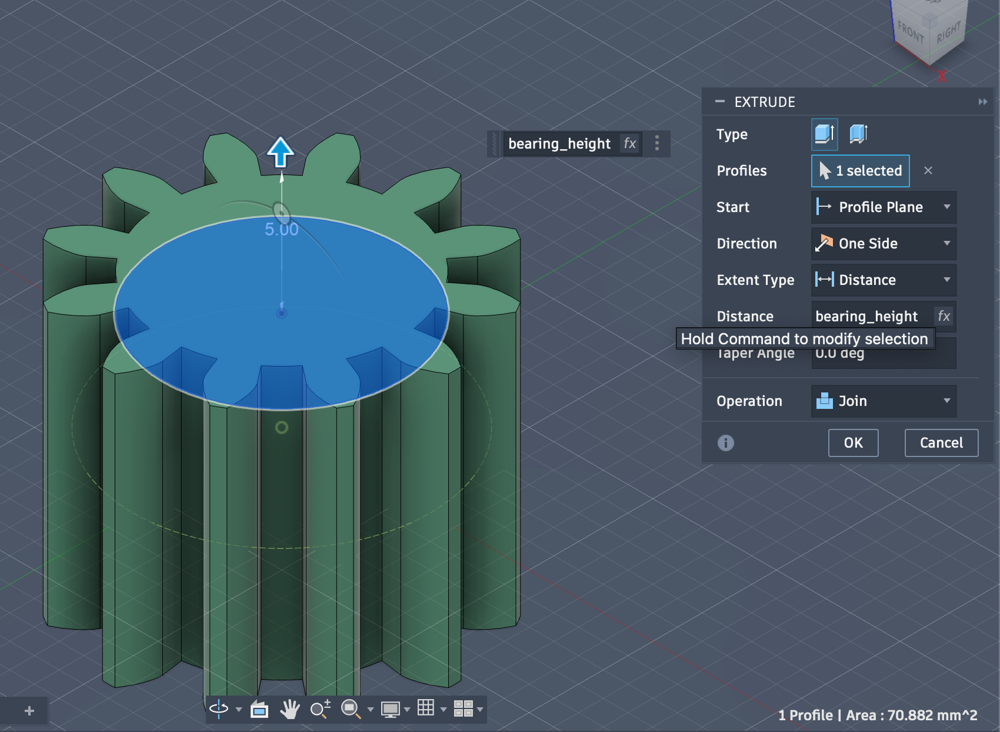
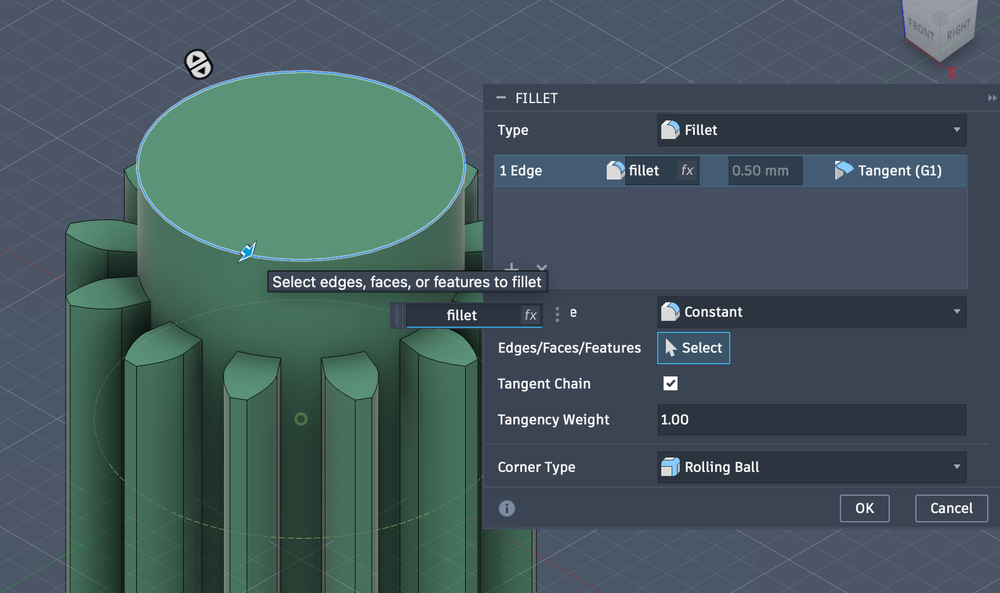

Export component as `Sun` to your project

Cut and fillet motor shaft

Chamfer from the inside

Should end up with this

Export component to project as `MotorInput`

Close current design without saving

_If you create another gearbox with a different gear ratio, `Sun` and `MotorInput` will stay the same, no need to regenerate them_

Move `SunTemp` to trash

---
In the same manner, open `PlanetModifier` and insert `PlanetTemp`

Break link

Cut hole for bearing

Fillet

Cut hole for bearing lip

Should end up with this

Export to project as `Planet`

Close current design without saving

Move `PlanetTemp` to trash

We now have all the components, time to combine them

### Assemble Components

Open `Ring`, import `RingBottom` and `RingTop`

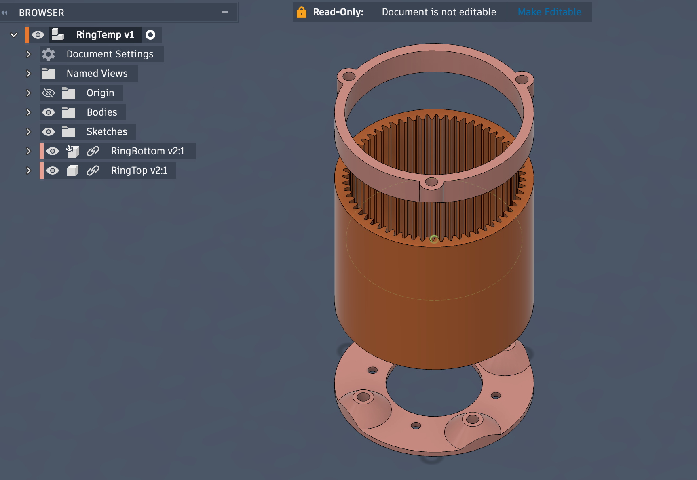

Join `RingBottom` and `Ring` at their bottoms

Join `Ring` and `RingTop` at their tops

Should end up with this

Combine all of them

Select and cut the 3 screw mounts

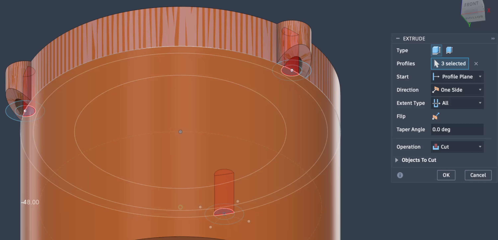

Remove `RingBottom` and `RingTop`

Save

---

Open `CarrierGenerator`, note the timeline is pulled back 2 steps

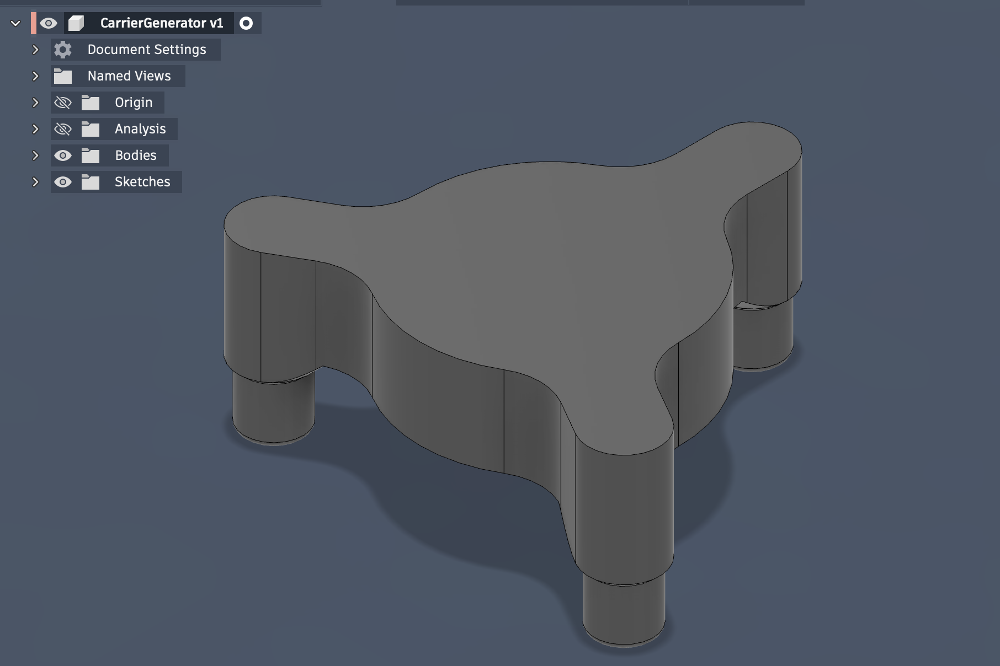

Insert `Sun`

Join `Sun`'s bottom with `Carrier`'s top at their centers

.png)

Should end up with this

Combine all of them as new component

Export it to project as `FirstStage`

Close current design without saving

---

Open `CarrierGenerator` again, move the timeline marker all the way to the end

Insert `CarrierOutput`

Join `CarrierOutput` bottom at `CarrierGenerator`'s top at their centers

Should end up with this

Combine all as new component, export it to project as `SecondStage`

### Export for Printing

* Cover
* FirstStage
* SecondStage
* Ring
* Planet
* MotorInput
* SunSpacer

❗ Make sure you print `SecondStage` at 45&deg; with 100% infill as it takes the most stress

[The Correct Orientation to Print Boxes](https://www.youtube.com/watch?v=8NKVNwVaZU0)

[Autodesk Fusion: Make supports like Slant 3D](https://www.youtube.com/watch?v=sn2u949g7dM)

Print 6 `Planet`s

Print 2 `SunSpacer`s (_1 per stage_)

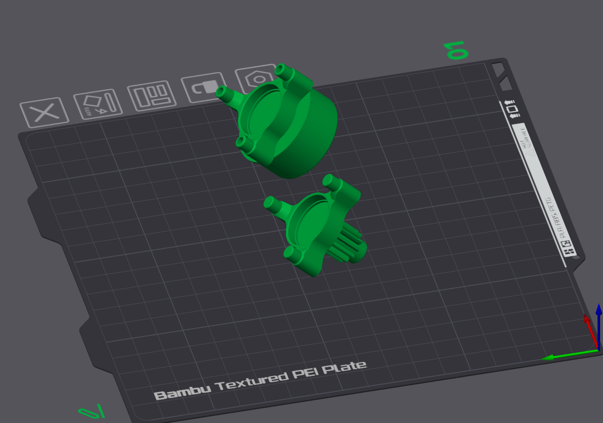
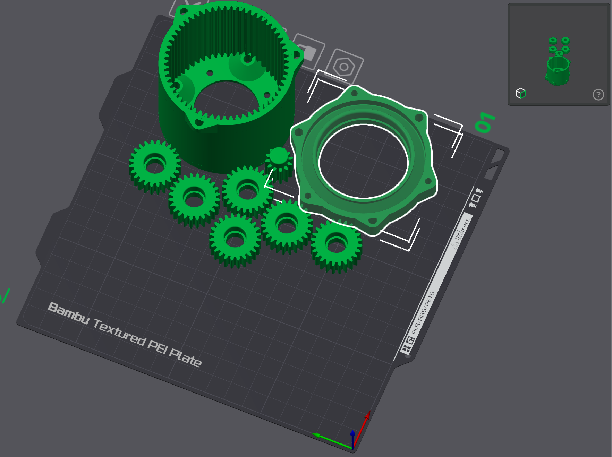

### Assembly
1. Press the heat sinks into the ring.

1. Secure the sun gear onto the motor shaft. 

1. Bolt the ring to the motor using four 6mm M3 bolts. 

1. Seat the first 12mm bearing into the first stage, followed by the sun top to lock the sun in place. 

1. Install the three 5mm bearings onto the pins, mount the planet gears, and slide the first stage into position. 

1. Repeat these steps for the second stage, adding the three 10mm M3 bolt pin supports. 

1. Fit the 35mm bearing onto the output shaft.

1. Attach the cover with three 16mm M3 bolts.

1. Press the remaining heat sinks into the cover and output shaft.
 
 _Bearing sizes will change depending on gear ratio_

https://github.com/user-attachments/assets/527c2508-7acf-4f8b-a0d8-41f765740e9c

